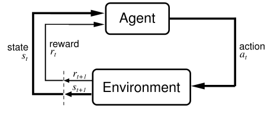
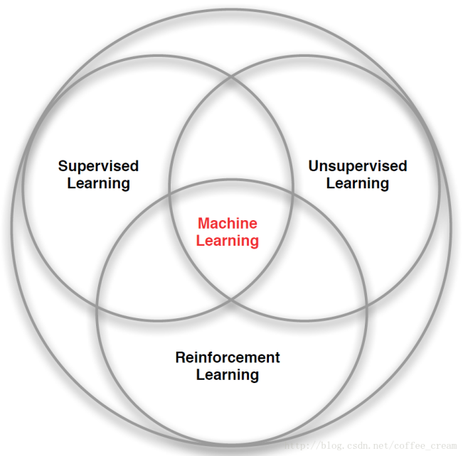

[TOC]

# 第十章 强化学习
<<<<<<< HEAD
## 10.1 什么是强化学习？
=======

## 10.1 强化学习介绍
>>>>>>> 7d194de87b4c9daefea704227e5d41c0ae686daa

强化学习是机器学习的另一个重要分支。然而与其他学习算法不同的是强化学习更测注重于动态连续决策问题，即强化学习更着重研究如何解决基于马尔可夫决策过程的问题。强化学习的灵感来源于来源于心理学中的[行为主义](https://zh.wikipedia.org/wiki/行为主义)理论，即有机体如何在环境给予的奖励或惩罚的刺激下，逐步形成对刺激的预期，产生能获得最大利益的习惯性行为。[^1] 强化学习同样包含一个类似有机体的智能体agent，其通过与环境进行不断的有效交互，从环境给出的奖励中优化自身的行为动作，从而不断最大化未来的奖励。agent与环境之间的交互可以将其建模为智能体agent不断的做出动作，环境根据其所作的动作随机的改变agent的状态，并给予agent一个奖励。

由上述可以看出强化学习的模型主要包含2个主体和四个元素：

+ 主体：智能体agent 和环境environment。

+ 元素：动作action、状态state、奖励reward、转移概率 transform probability

我们列举几个形象的例子：

海豚在水族馆中训练被的时候，海豚观察到训练员给出的手势（状态），海豚看到这个手势之后会做出反应，它在一开始的时候可能并不知道，训练员的指令是什么，就会按照它们的习惯动几下（动作），但是这个动作并不是训练员所需要的，所以并不会给海豚食物（reward）。可是有几次海豚的习惯性的动作，正好符合了训练员的指令，这个时候海豚得到了食物，它就会记得 下次看到这个手势 还做这个动作，那么就会得到食物。

在这个例子中海豚是agent， 训练员是环境，食物是奖励，reward，海豚通过不断的与训练员的沟通，得到训练员给的食物，从而学会了训练员的指令。这就是强化学习的过程。

上图中agent代表自身，如果是自动驾驶，agent就是车；如果你玩游戏它就是你当前控制的游戏角色，如马里奥，马里奥往前走时环境就一直在发生变化，有小怪物或者障碍物出现，它需要通过跳跃来进行躲避，就是要做action（如向前走和跳起的动作）；无人驾驶的action就是车左转、右转或刹车等等，它无时无刻都在与环境产生交互，action会反馈给环境，进而改变环境，如果自动驾驶的车行驶目标是100米，它向前开了10米，那环境就发生了变化，所以每次产生action都会导致环境改变，环境的改变会反馈给自身（agent），就是这样的一个循环；反馈又两种方式：1、做的好（reward）即正反馈，2、做得不好（punishment惩罚）即负反馈。Agent可能做得好，也可能做的不好，环境始终都会给它反馈，agent会尽量去做对自身有利的决策，通过反反复复这样的一个循环，agent会越来越做的好，就像孩子在成长过程中会逐渐明辨是非，这就是强化学习。

## 10.2 强化学习的发展过程

早期，强化学习又被作试错学习。人们在观察动物们的过程，发现动物们擅长不断的进行尝试，然后发现

并借鉴于人工智能

## 10.3 强化学习应用实例

（1）Manufacturing

例如一家日本公司 Fanuc，工厂机器人在拿起一个物体时，会捕捉这个过程的视频，记住它每次操作的行动，操作成功还是失败了，积累经验，下一次可以更快更准地采取行动。

（2）Inventory Management

在库存管理中，因为库存量大，库存需求波动较大，库存补货速度缓慢等阻碍使得管理是个比较难的问题，可以通过建立强化学习算法来减少库存周转时间，提高空间利用率。

（3）Dynamic pricing

强化学习中的 Q-learning 可以用来处理动态定价问题。

（4）Customer Delivery

制造商在向各个客户运输时，想要在满足客户的所有需求的同时降低车队总成本。通过 multi-agents 系统和 Q-learning，可以降低时间，减少车辆数量。

（5）ECommerce Personalization

在电商中，也可以用强化学习算法来学习和分析顾客行为，定制产品和服务以满足客户的个性化需求。

（6）Ad Serving

例如算法 LinUCB （属于强化学习算法 bandit 的一种算法），会尝试投放更广范围的广告，尽管过去还没有被浏览很多，能够更好地估计真实的点击率。
再如双 11 推荐场景中，阿里巴巴使用了深度强化学习与自适应在线学习，通过持续机器学习和模型优化建立决策引擎，对海量用户行为以及百亿级商品特征进行实时分析，帮助每一个用户迅速发现宝贝，提高人和商品的配对效率。还有，利用强化学习将手机用户点击率提升了 10-20%。

（7）Financial Investment Decisions

例如这家公司 Pit.ai，应用强化学习来评价交易策略，可以帮助用户建立交易策略，并帮助他们实现其投资目标。

（8）Medical Industry

动态治疗方案（DTR）是医学研究的一个主题，是为了给患者找到有效的治疗方法。 例如癌症这种需要长期施药的治疗，强化学习算法可以将患者的各种临床指标作为输入 来制定治疗策略。
## 10.4 强化学习的种类

按照模型分类，可以分为无模型强化学习和有模型强化学习

按照策略分类，可以分为基于值方法的强化学习和基于策略方法的强化学习

按照学习过程分，还可以分类为在线学习和离线学习两种。

## 10.5 强化学习和监督式学习、非监督式学习有什么区别？

在机器学习中，我们比较熟知的是监督式学习，非监督学习，此外还有一个大类就是强化学习：
当前的机器学习算法可以分为3种：有监督的学习（Supervised Learning）、无监督的学习（Unsupervised Learning）和强化学习（Reinforcement Learning），结构图如下所示：

 

### 10.3.1 强化学习和监督式学习的区别：

监督式学习就好比你在学习的时候，有一个导师在旁边指点，他知道怎么是对的怎么是错的，但在很多实际问题中，例如 chess，go，这种有成千上万种组合方式的情况，不可能有一个导师知道所有可能的结果。

而这时，强化学习会在没有任何标签的情况下，通过先尝试做出一些行为得到一个结果，通过这个结果是对还是错的反馈，调整之前的行为，就这样不断的调整，算法能够学习到在什么样的情况下选择什么样的行为可以得到最好的结果。

就好比你有一只还没有训练好的小狗，每当它把屋子弄乱后，就减少美味食物的数量（惩罚），每次表现不错时，就加倍美味食物的数量（奖励），那么小狗最终会学到一个知识，就是把客厅弄乱是不好的行为。

两种学习方式都会学习出输入到输出的一个映射，监督式学习出的是之间的关系，可以告诉算法什么样的输入对应着什么样的输出，强化学习出的是给机器的反馈 reward function，即用来判断这个行为是好是坏。
另外强化学习的结果反馈有延时，有时候可能需要走了很多步以后才知道以前的某一步的选择是好还是坏，而监督学习做了比较坏的选择会立刻反馈给算法。

而且强化学习面对的输入总是在变化，每当算法做出一个行为，它影响下一次决策的输入，而监督学习的输入是独立同分布的。

通过强化学习，一个 agent 可以在探索和开发（exploration and exploitation）之间做权衡，并且选择一个最大的回报。 

exploration 会尝试很多不同的事情，看它们是否比以前尝试过的更好。 

exploitation 会尝试过去经验中最有效的行为。

一般的监督学习算法不考虑这种平衡，就只是是 exploitative。

### 10.3.2 强化学习和非监督式学习的区别：

非监督式不是学习输入到输出的映射，而是模式。例如在向用户推荐新闻文章的任务中，非监督式会找到用户先前已经阅读过类似的文章并向他们推荐其一，而强化学习将通过向用户先推荐少量的新闻，并不断获得来自用户的反馈，最后构建用户可能会喜欢的文章的“知识图”。

对非监督学习来说，它通过对没有概念标记的训练例进行学习，以发现训练例中隐藏的结构性知识。这里的训练例的概念标记是不知道的，因此训练样本的歧义性最高。对强化学习来说，它通过对没有概念标记、但与一个延迟奖赏或效用（可视为延迟的概念标记）相关联的训练例进行学习，以获得某种从状态到行动的映射。这里本来没有概念标记的概
念，但延迟奖赏可被视为一种延迟概念标记，因此其训练样本的歧义性介于监督学习和非监督学习之间。

需要注意的是，监督学习和非监督学习从一开始就是相对的，而强化学习在提出时并没有从训练样本歧义性的角度考虑其与监督学习和非监督学习的区别，因此，一些早期的研究中把强化学习视为一种特殊的非监督学习。事实上，对强化学习的定位到目前仍然是有争议的，有的学者甚至认为它是与“从例子中学习”同一级别的概念。

从训练样本歧义性角度进行的分类体系，在近几年可望有一些扩展，例如多示例学习（multi-instancelearning）等从训练样本歧义性方面来看很特殊的新的学习框架有可能会进入该体系。但到目前为止，没有任何新的框架得到了公认的地位。另外，半监督学习（semi-supervisedlearning）也有一定希望，它的障碍是半监督学习中的歧义性并不是与生俱来的，而是人为的，即用户期望用未标记的样本来辅助对已标记样本的学习。这与监督学习、非监督学习、强化学习等天生的歧义性完全不同。半监督学习中人为的歧义性在解决工程问题上是需要的、有用的（对大量样本进行标记的代价可能是极为昂贵的），但可能不太会导致方法学或对学习问题视点的大的改变。

**强化学习和前二者的本质区别**:没有前两者具有的明确数据概念，它不知道结果，只有目标。数据概念就是大量的数据，有监督学习、无监督学习需要大量数据去训练优化你建立的模型，就像猫狗识别，用n多张猫狗图片去训练模型，经过训练优化后，你用一张崭新的猫狗图片让模型作出判断，这个模型就知道是猫还是狗。

## 10.4 什么是马尔科夫决策过程？

俄罗斯数学家安德雷·马尔科夫首先定义了一种特殊的随机过程，这种随机过程在给定的当前以及过去所有状态的情况下，其下一步的条件概率仅仅依赖于当前的状态，而与过去的状态条件独立。通常，可以称这种随机变量具有马尔科夫特性。具有马尔科夫特性的离散随机过程也称作马尔科夫链。马尔科夫链数学表达公式是：
$$
\operatorname{Pr}[X(T+1) | X(t), t \leq T]=\operatorname{Pr}[X(T+1) | X(t)=x(T)]
$$

## 参考文献：

[^1]:维基百科.强化学习[EB/OL][https://zh.wikipedia.org/wiki/%E5%BC%BA%E5%8C%96%E5%AD%A6%E4%B9%A0](https://zh.wikipedia.org/wiki/强化学习).2019-7.